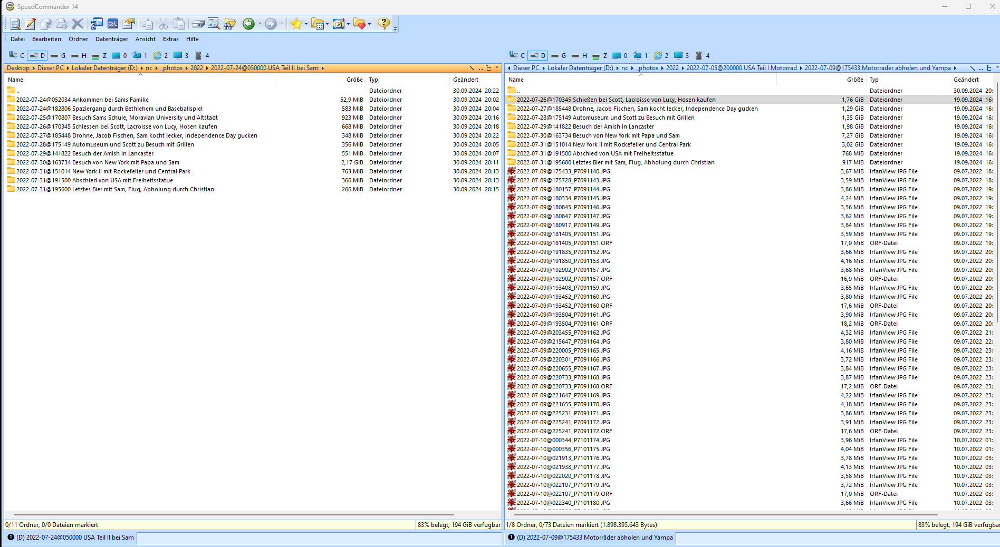

# Todos

- [ ] Write tests for sequence checker of grouper
- [ ] Conversion: assure xmp-tags are maintained after conversion (especially for videos: xmp:date is vanished) by reading them before conversion and writing them to result
- [ ] new flag --filedialog to enable selection of folders/files on which to apply the current stage command
- [ ] bug: mp4-files don't get xmp:Date written and are missing longitude and latitude gps values
- [ ] bug: unknown bug (maybe due to a nextcloud bug or virtual files) causes deleted files to be present in completely unrelated directories. Example:  It is interesting, that the first folder contains a 'ß' whereas the correct folder uses 'ss'. This was changed by me due to issues in xmp-metadata.
- [ ] bug: stage history writes tag **sourcefile** sometimes
- [ ] feature: check if all stages were passed during **aggregation** using history of xmp:contributor
- [ ] feature: make it possible to disable interpolation in localize
- [x] define an entrypoint for mow in order to make it possible to install mow globally and create distributions
- [x] add option to use xmp sidecars files instead direct writing to file in every stage except aggregate. Advantages:
  - increases sync performance (no big file will be changed then, so moving is enough for cloud clients).
  - increases the overall performance of the program, as only little files have to be rewritten. In the aggregate-stage the xmp files could be baked into the mediafiles. 
  - what's in the xmp data is much more easily readable (and also writable!), especially from mobile devices.
  - during rewriting, mediafiles could get corrupted (e.g. when the pc crashes). To reduce the risk of data loss, only moving but never touching (except from the last stage) the mediafiles reduces the risk of data loss
  - the problem of multiple files having different xmp-data would vanish. E.g. jpg and raw-images with the same name would share the same xmp-file and therefore the problem of diverging xmp-infos between raw and jpg would never occur.
- [ ] change tests to use sidecar files in all stages except aggregate
- [ ] introduce .mow-folder where all metadata lies and make it copyable and location-agnostic such as git